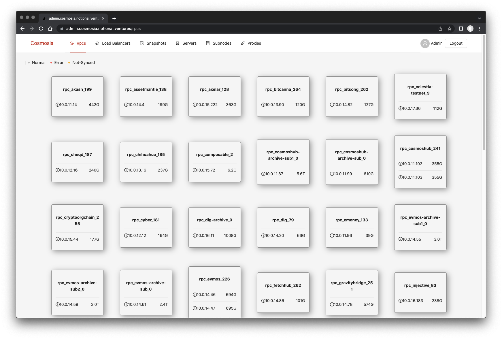

# cosmosia (Cosmos Infrastructure Automation)

Open solution to build a reliable infrastructure for cosmos/tendermint based chains ( see [background](https://github.com/cosmos/chain-registry/issues/214) ):

Cosmosia has been used in production for Notional for more than one year.
However, there are many places that are hard-coded for Notional. Make it so hard for anyone to deploy their own cluster.
From v0.2.x we'll fix it by make it easier to spin up a new cluster, and manage it with the web-admin instead of command lines.

### Docs
See [Docs](https://notional-labs.github.io/cosmosia/#/)
