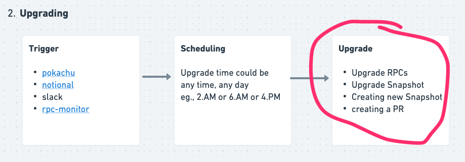
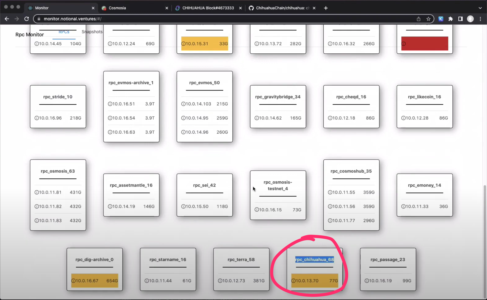
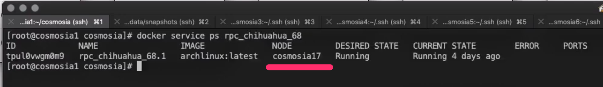
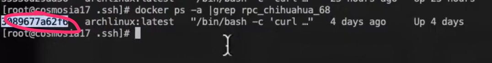
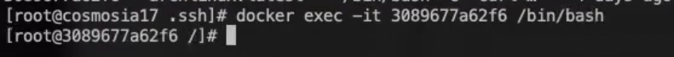
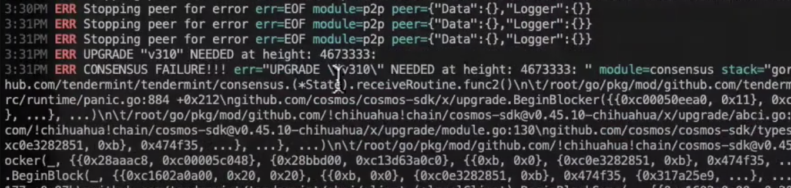
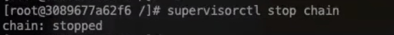

# Upgrade a chain

How to upgrade a chain including RPC service and snapshot service.




### Video Log

[Cosmosia Video Log - Upgrade a chain](https://www.youtube.com/embed/GCFg9nPdTmE ':include :type=iframe width=100% height=400px')


### Upgrade RPCs

#### A. Get into RPC container console:
1. At the upgrading block, chain stops synching. And `rpc_monitor` marks it with `yellow` or `red` color.
    
    

    Its `rpc_chihuahua_68` in this example
   

2. Next, we need to figure out which swarm node running the rpc service by running this command in a swarm manager node:
    
    ```console
    docker service ps rpc_chihuahua_68
    ```

    
   
    Its in `cosmosia17` node in this example.
   

3. Then get into `cosmosia17` console and run this command to figure out which container running the rpc service:

    ```console
    docker ps -a |grep rpc_chihuahua_68
    ```

    
   
    Its `3089677a62f6` in this example.
   

4. Now, get into the container console by running this command on `cosmosia17` node:

    ```console
    docker exec -it 3089677a62f6 /bin/bash
    ```

    


#### B. Do the upgrade

1. Check the log of the chain to confirm there's an upgrade. Run this command inside container console.

   ```console
   tail -n1000 /var/log/chain.err.log
   ```

   
   

2. Make sure the chain is stopped by running this command inside container console:

   ```console
   supervisorctl stop chain
   ```

   


3. Follow steps in [Workaround when upgrading a chain running PebbleDB](https://notional-labs.github.io/cosmosia/#/pebbledb?id=workaround-when-upgrading-a-chain-running-pebbledb) note to upgrade the chain.
   
   Some chains require build differently, see more at [Special chains](https://notional-labs.github.io/cosmosia/#/snapshot_usage?id=special-chains)
   
   
### Upgrade Snapshot
TODO...

### Create a new snapshot (post-upgrade)
TODO...

### Create a Pull Request to update `chain-registry.ini`
TODO...