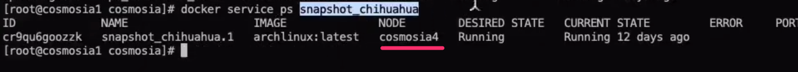
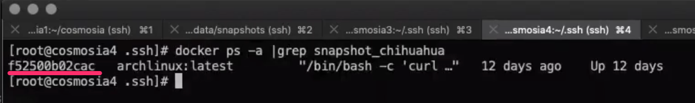
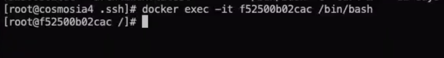
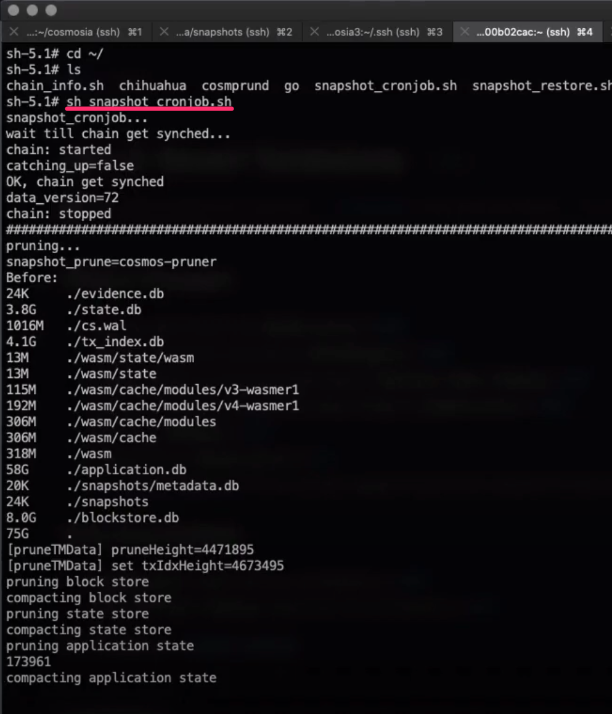
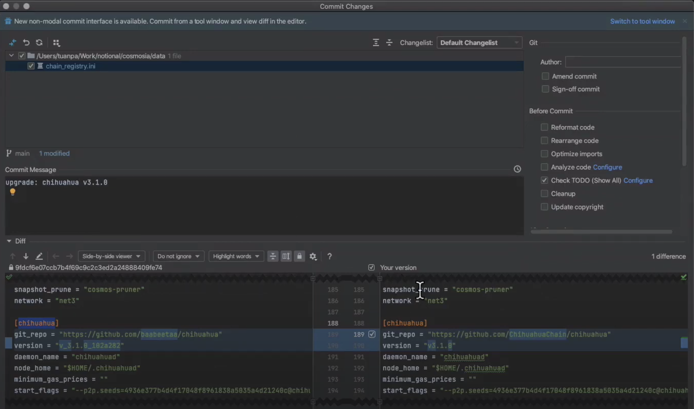

# Upgrade a chain

How to upgrade a chain including RPC service and snapshot service.


### Video Log

[Cosmosia Video Log - Upgrade a chain](https://www.youtube.com/embed/GCFg9nPdTmE ':include :type=iframe width=100% height=400px')


### Upgrade RPCs

#### A. Get into RPC container console:
1. At the upgrading block, chain stops synching. And `rpc_monitor` marks it with `yellow` or `red` color.
    
    

    Its `rpc_chihuahua_68` in this example
   

2. Next, we need to figure out which swarm node running the rpc service by running this command in a swarm manager node:
    
    ```console
    docker service ps rpc_chihuahua_68
    ```

    
   
    Its in `cosmosia17` node in this example.
   

3. Then get into `cosmosia17` console and run this command to figure out which container running the rpc service:

    ```console
    docker ps -a |grep rpc_chihuahua_68
    ```

    
   
    Its `3089677a62f6` in this example.
   

4. Now, get into the container console by running this command on `cosmosia17` node:

    ```console
    docker exec -it 3089677a62f6 /bin/bash
    ```

    


#### B. Do the upgrade

1. Check the log of the chain to confirm there's an upgrade. Run this command inside container console.

   ```console
   tail -n1000 /var/log/chain.err.log
   ```

   
   

2. Make sure the chain is stopped by running this command inside container console:

   ```console
   supervisorctl stop chain
   ```

   


3. Follow steps in [Workaround when upgrading a chain running PebbleDB](https://notional-labs.github.io/cosmosia/#/pebbledb?id=workaround-when-upgrading-a-chain-running-pebbledb) note to upgrade the chain.
   
   Some chains require build differently, see more at [Special chains](https://notional-labs.github.io/cosmosia/#/snapshot_usage?id=special-chains)
   
   
### Upgrade Snapshot
#### A. Get into snapshot container console:
1. Figure out which swarm node running the snapshot service by running this command in a swarm manager node:
    
    ```console
    docker service ps snapshot_chihuahua
    ```

    
   
    Its in `cosmosia4` node in this example.

2. Then get into `cosmosia4` console and run this command to figure out which container running the snapshot service:

    ```console
    docker ps -a |grep snapshot_chihuahua
    ```

    
   
    Its `f52500b02cac` in this example.


3. Now, get into the container console by running this command on `cosmosia4` node:

    ```console
    docker exec -it f52500b02cac /bin/bash
    ```

    

#### B. Do the upgrade
The process is similar to [Upgrade RPCs / Do the upgrade](https://notional-labs.github.io/cosmosia/#/admin_upgrade_a_chain?id=b-do-the-upgrade)

**Note**: There is a cron job to take snapshot daily, disable it while doing the upgrade to void cronjob running during the upgrading process then remember to enable it back when done.

Disable crond command:
```console
killall crond
```

Enable crond command:
```console
crond
```

### Create a new snapshot (post-upgrade)
After upgrading rpc for snapshot service in step above, we'll like to take a post-upgrading snapshot manually.

crond should be disabled in the process.

Run the `snapshot_cronjob.sh` to create the new snapshot. Should be run with `screen` to avoid interrupting like losing network connection.

```console
screen -S snapshot

# in screen
sh snapshot_cronjob.sh
```




### Create a Pull Request to update `chain-registry.ini`


