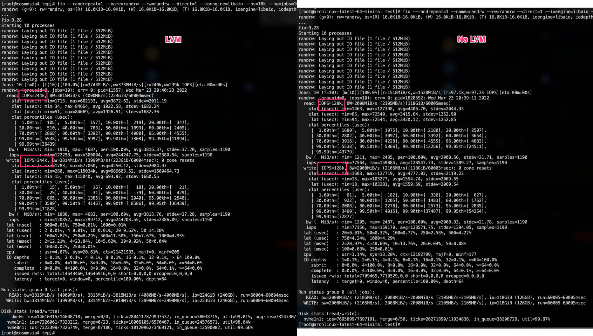

# LVM - Logical Volume Manager (Linux) 

If your node has more than 1 ssd/nvme. Striped Logical Volume in LVM could improve iops.

```bash
fio --randrepeat=1 --name=randrw --rw=randrw --direct=1 --ioengine=libaio --bs=16k --numjobs=10 --size=512M --runtime=60 --time_based --iodepth=64 --group_reporting
randrw: (g=0): rw=randrw, bs=(R) 16.0KiB-16.0KiB, (W) 16.0KiB-16.0KiB, (T) 16.0KiB-16.0KiB, ioengine=libaio, iodepth=64
```



### Setup
This is a sample setup of my cluster, each node has 2 nvme sticks.

```bash
pvcreate -v /dev/nvme0n1p5 /dev/nvme1n1p2
vgcreate -v vg0 /dev/nvme0n1p5 /dev/nvme1n1p2
lvcreate -L 100G -i 2 -I 128k -n lv_data vg0 -v
lvextend -l +100%FREE /dev/vg0/lv_data
mkfs.ext4 /dev/vg0/lv_data

lvdisplay /dev/vg0/lv_data -m
mount /dev/vg0/lv_data /mnt/data
```

add to `/etc/fstab`:
```
/dev/vg0/lv_data /mnt/data defaults 0 0
```

---
### Change docker data location to use the striped volume

```bash
mkdir -p /mnt/data/docker
```

Add `"data-root": "/mnt/data/docker"` to `/etc/docker/daemon.json`:
```json
{
  "data-root": "/mnt/data/docker",
  "log-driver": "json-file",
  "log-opts": {
    "max-size": "10m",
    "max-file": "3"
  }
}
```

Restart docker with `systemctl restart docker`
