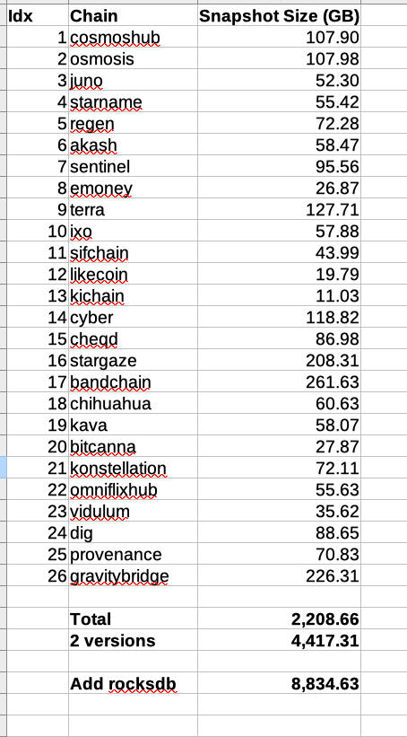

# Snapshot

## Snapshot storage
- Daily snapshots are stored on container. Data will be lost if container down. So we need to backup with `Snapshot Backup`
- Weekly (could be changed to daily, 2 days, 3 days...) snapshot are stored on `Snapshot Backup`

### Snapshot Backup
Use [syncthing](syncthing.md), atm there are only 2 containers on the swarm. Should move to a dedicated box / storage box
to optimize cost. NVme should be used for db only, not for archived/backup storage.
