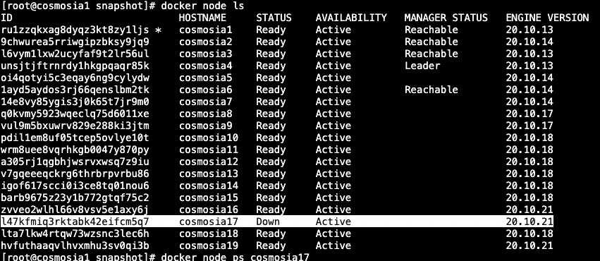
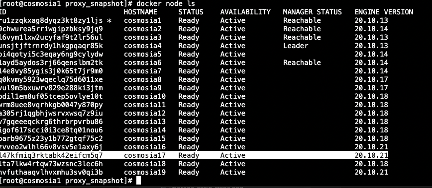

## How to handle a swarm node down

When a swarm node down like hardware failure or un-responsible.



1. First, need to restart that node to make sure its reachable.




2. Figure out services running on that node

```console
[root@cosmosia1 snapshot]# docker node ps cosmosia17
ID             NAME                         IMAGE              NODE         DESIRED STATE   CURRENT STATE         ERROR     PORTS
ve6tikwm0br7   proxysnapshot_cosmosia17.1   archlinux:latest   cosmosia17   Shutdown        Running 3 weeks ago             *:11111->80/tcp,*:11111->80/tcp
vf5d7i6iu6r0   rpc_bandchain_83.1           archlinux:latest   cosmosia17   Shutdown        Running 3 weeks ago
jwrntfyk2c20   rpc_chihuahua_104.1          archlinux:latest   cosmosia17   Shutdown        Running 6 days ago
4yjuodxjaivu   rpc_cryptoorgchain_83.1      archlinux:latest   cosmosia17   Shutdown        Running 3 weeks ago
wiaynl0dg180   rpc_evmos_70.1               archlinux:latest   cosmosia17   Shutdown        Running 3 weeks ago
i4omj291mqhi   rpc_irisnet_81.1             archlinux:latest   cosmosia17   Shutdown        Running 3 weeks ago
q4d4hi713wun   snapshot_evmos-archive.1     archlinux:latest   cosmosia17   Shutdown        Running 3 weeks ago
```

3. Re-deploy services in order
- Re-deploy `proxysnapshot` service
```console
[root@cosmosia1 proxy_snapshot]# pwd
/root/cosmosia/proxy_snapshot
[root@cosmosia1 proxy_snapshot]# sh docker_service_create.sh cosmosia17
proxysnapshot_cosmosia17
jku7inouwj8kzjgycldn8i2vb
overall progress: 1 out of 1 tasks
1/1: running   [==================================================>]
verify: Service converged
```

- Re-deploy `snapshot` service
```console
[root@cosmosia1 snapshot]# sh docker_service_create_snapshot.sh evmos-archive
network=net6
HOST=cosmosia17
SERVICE_NAME=snapshot_evmos-archive
snapshot_evmos-archive
ygpv7h5xsxqm95vxa7mwwmml7
overall progress: 1 out of 1 tasks
1/1: running   [==================================================>]
verify: Service converged
```

- Re-deploy `rpc` service
```console
[root@cosmosia1 rpc]# pwd
/root/cosmosia/rpc
[root@cosmosia1 rpc]#
[root@cosmosia1 rpc]# sh docker_service_create.sh bandchain
network=net3
Error: No such service: rpc_bandchain_87
0tgn0zklkf71vru2k138zt2q2
overall progress: 1 out of 1 tasks
1/1: running   [==================================================>]
verify: Service converged
[root@cosmosia1 rpc]#
[root@cosmosia1 rpc]# sh docker_service_create.sh chihuahua
network=net3
Error: No such service: rpc_chihuahua_110
kw1kcuhdv532tiplchujz47a3
overall progress: 1 out of 1 tasks
1/1: running   [==================================================>]
verify: Service converged
[root@cosmosia1 rpc]#
[root@cosmosia1 rpc]#
[root@cosmosia1 rpc]# sh docker_service_create.sh cryptoorgchain
network=net5
Error: No such service: rpc_cryptoorgchain_109
rpyqkcooymplopvo76nvz2cgs
overall progress: 1 out of 1 tasks
1/1: running   [==================================================>]
verify: Service converged
[root@cosmosia1 rpc]# sh docker_service_create.sh irisnet
network=net5
Error: No such service: rpc_irisnet_107
unibip0eh8unr7t88j5q8jckw
overall progress: 1 out of 1 tasks
1/1: running   [==================================================>]
verify: Service converged
[root@cosmosia1 rpc]# docker service scale rpc_evmos_70=2
rpc_evmos_70 scaled to 2
overall progress: 2 out of 2 tasks
1/2: running   [==================================================>]
2/2: running   [==================================================>]
verify: Service converged
[root@cosmosia1 rpc]# docker service scale rpc_evmos_70=3
rpc_evmos_70 scaled to 3
overall progress: 3 out of 3 tasks
1/3: running   [==================================================>]
2/3: running   [==================================================>]
3/3: running   [==================================================>]
verify: Service converged
```

- Re-deploy `loadbalancer` service
Required for rpc service with single instance only
```console
[root@cosmosia1 load_balancer]# pwd
/root/cosmosia/load_balancer
[root@cosmosia1 load_balancer]#
[root@cosmosia1 load_balancer]# sh docker_service_create.sh bandchain rpc_bandchain_87
network=net3
lb_bandchain
yygtcznnpw6pasa03f7ljm8iy
overall progress: 1 out of 1 tasks
1/1: running   [==================================================>]
verify: Service converged
[root@cosmosia1 load_balancer]# sh docker_service_create.sh chihuahua rpc_chihuahua_110
network=net3
lb_chihuahua
zk6m30itb0elnixp1gb7u434x
overall progress: 1 out of 1 tasks
1/1: running   [==================================================>]
verify: Service converged
[root@cosmosia1 load_balancer]# sh docker_service_create.sh cryptoorgchain rpc_cryptoorgchain_109
network=net5
lb_cryptoorgchain
v767qdsdxb2makhn5fjmcvkyl
overall progress: 1 out of 1 tasks
1/1: running   [==================================================>]
verify: Service converged
[root@cosmosia1 load_balancer]# sh docker_service_create.sh irisnet rpc_irisnet_107
network=net5
lb_irisnet
2owlqwt3usancxz4ojusc5plx
overall progress: 1 out of 1 tasks
1/1: running   [==================================================>]
verify: Service converged
```

- Remove old rpc services

```console
[root@cosmosia1 cosmosia]# docker service rm rpc_bandchain_83
rpc_bandchain_83
[root@cosmosia1 cosmosia]# docker service rm rpc_chihuahua_104
rpc_chihuahua_104
[root@cosmosia1 cosmosia]# docker service rm rpc_cryptoorgchain_83
rpc_cryptoorgchain_83
[root@cosmosia1 cosmosia]# docker service rm rpc_irisnet_81
rpc_irisnet_81
```
